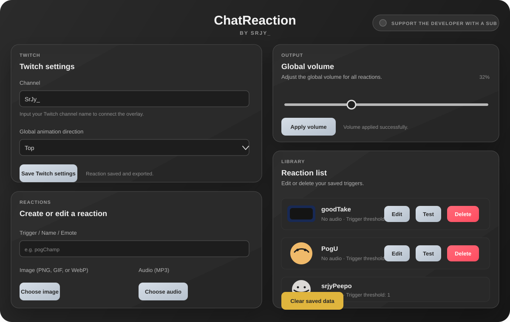

# ChatReaction

ChatReaction is an Electron desktop app that lets you create custom stream reactions (image + audio) and trigger them from Twitch chat.

## Interface Preview



## Features

- Clean visual editor for reaction setup.
- Media support: PNG, GIF, WebP images and MP3 audio.
- Trigger matching by exact chat text.
- Built-in anti-spam cooldown for repeated triggers.
- Global animation direction and global volume control.
- Local Browser Source workflow for OBS/Streamlabs using `reaction.html`.
- In-app reaction preview/testing.

## How It Works

1. Create a reaction in the app:
- Trigger text (word, emote, or phrase)
- Image file
- Optional audio file
- Trigger threshold

2. Save it and add `reaction.html` as a local Browser Source in OBS/Streamlabs.

3. Set your Twitch channel in the app and save settings.
- The exported overlay config is updated automatically.
- The overlay can connect anonymously in read-only mode.

## Development

```bash
npm install
npm run start
```

## Build Commands

General build:

```bash
npm run dist
```

Platform-specific builds:

```bash
npm run dist:linux
npm run dist:win
npm run dist:mac
```

Each platform build command also runs `release:bundle`, so `reaction.html` and `overlay-config.js` are always created in the unified output folder.

## Single-Folder Multi-Platform Bundle

To assemble all available artifacts into one folder with launchers:

```bash
npm run release:bundle
```

Output folder:

- `release/ChatReaction-MultiPlatform`

Contents:

- `reaction.html` (root)
- `overlay-config.js` (root)
- `windows/` (Windows executable artifacts)
- `linux/` (AppImage and optional Linux zip)
- `macos/` (macOS zip and/or dmg if present)
- `launch-windows.bat`
- `launch-linux.sh`
- `launch-macos.command`

## OBS / Streamlabs Setup

1. Add a Browser Source.
2. Use the local `file:///.../reaction.html` path shown by the app after saving.
3. Set your preferred source size in OBS (for example, 1920x1080).

## Notes

- Reactions and settings are persisted through the app data flow and exported into `overlay-config.js`.
- The app maintains a runtime overlay copy (reaction + config) in a stable user data location, and exposes that exact path in the UI for OBS.